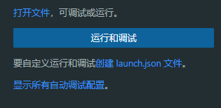

# Devbox 的基本使用

# **什么是 Devbox？**

Devbox 是一个命令行工具，可让您轻松创建用于开发的隔离 shell。首先定义项目所需的包列表，Devbox 将创建一个隔离的、可重现的环境，并安装这些包。在实践中，Devbox 的工作方式类似于像 yarn 这样的包管理器，也类似与 Node 版本切换工具 n、nvm 等。但 Devbox 更近一步，可以实现多个工具的环境切换，并且支持团队同步管理等特性。


使用 Devbox 动态创建隔离的开发环境

## **为什么使用 Devbox？**

与纯 Docker 容器，Nix Shells 或直接管理自己的环境相比，Devbox 提供了很多好处。

### **为团队中的每个人提供一致的 shell**

通过文件 `devbox.json` 声明项目所需的工具列表并运行 devbox shell。每个从事该项目的人都会得到一个 shell 环境，和工具的完全相同的版本。

### **在不污染笔记本电脑的情况下尝试新工具**

Devbox 创建的开发环境与笔记本电脑中的其他所有环境隔离。比如我们在试用一个新工具或新版本的时候可以将其添加到 Devbox shell 中使用，不再需的时候可以随时将其删除。同时保持笔记本电脑的原始状态。在开发环境中删除或更改包就像编辑 `devbox.json` 文件一样简单。

### **不要牺牲速度**

Devbox 可以直接在系统内创建隔离的环境，而无需额外的虚拟化层，减慢文件系统速度。

### **告别冲突版本**

如果我们在同时开发多个项目，可能不同的项目使用的工具、库等是不一样的，去切换环境是一件比较麻烦的事情。使用 Devbox  可以为每个项目创建一个隔离的环境，并为每个项目使用所需的任何版本。

### **随身携带的开发环境**

Devbox 的开发环境是*可移植的*。我们可以只声明一次环境，并以多种不同的方式使用该定义，包括：

- 通过 `devbox shell` 创建的本地 shell
- • 可与 VSCode 一起使用的开发容器
- 一个Dockerfile，可以使用与开发相同的工具来构建生产镜像。
- 云中的远程开发环境，可镜像本地环境。

# ****安装****

以*非 root 用户*身份运行以下安装脚本以安装最新版本的 Devbox，适用 Linux、MacOS 以及 Windows 下的 WSL 环境。

```bash
curl -fsSL https://get.jetpack.io/devbox | bash
```

Devbox 需要 Nix 包管理器。如果在运行命令时未检测到 Nix，Devbox 将在 Linux 的单用户模式下为您安装它，这个过程是自动的，并不需要我们操心。如果您想自己安装 Nix，可以参考 [Desure Nix 安装程序](https://determinate.systems/posts/determinate-nix-installer)。

# **创建和启用开发环境**

我们将使用所需的包创建新的开发环境。这些软件包仅在使用此 Devbox shell 时可用，以确保我们不会污染您的计算机。

1. 在新的空文件夹中打开终端。
2. 初始化开发框：`devbox init` 。这将在当前目录中创建一个文件`devbox.json`，可以将这个文件提交到源代码管理，以在团队之间同步管理环境。
3. 使用 `devbox search` 添加 Devbox 项目的包。例如，要搜索 Python 包，您可以运行`devbox search python3` 。软件包的名称使用 Nix  的包名称，可以通过 [NixOS Search](https://search.nixos.org/packages) 查看。
4. 通过 `devbox add <package>` 将包添加到项目中。默认安装 latest 版本，如果要安装特定版本的软件包，可以运行 `devbox add <package>@<version>` 。例如，要安装 Python 3.10，您可以运行 `devbox add python@3.10` 。添加的包会使用 `devbox.json` 文件管理。内容如下所示：

```json
{
    "packages": [
        "python@3.10"
    ]
}
```

1. 启动一个安装了软件包和工具的新 shell：`devbox shell` 。第一次运行时可能需要一段时间才能完成，因为 Devbox 下载依赖和 Nix 要求的包目录。然后会进入 Devbox shell 而不是你的常规终端，shell 提示符和目录会有所变化。
2. 常规工具配置也可以使用 Devbox 隔离，包括环境变量和配置设置，如：`git config --get user.name`
3. 要退出 Devbox shell 并返回到常规 shell，执行 `exit` 即可退出
4. 若要共享项目和 shell，需要将 `devbox.json` 和 `devbox.lock` 文件签入源代码管理。这些文件将确保开发人员在运行项目时获得相同的包和环境。
5. 如果要更新软件包，可以运行 `devbox update` 。此命令会将所有固定包更新到 Devbox 索引中的最新兼容版本。如果添加包没用使用版本号，那么 Devbox 将默认使用我们 Nixpkg 索引中的最新可用版本的软件包。这与添加 `<pkg>@<latest>` 到 devbox.json 相同。例如，要使用最新版本的 `ripgrep` ， 使用 `devbox add ripgrep` 、`devbox add ripgrep@latest` 或添加 `ripgrep@latest` 到 devbox.json 包列表中的效果是相同的。每当您运行 `devbox update` 时，具有最新标记的包都将更新到我们索引中可用的最新版本。

## **将提醒徽章添加到存储库**

将 Devbox 项目发布到 Github 后，可以通过将 Devbox 徽章添加到存储库来帮助其他开发人员。复制下面的代码片段并将其粘贴到 README.md 中以添加徽章。


```markdown
[](https://jetpack.io/devbox/docs/contributor-quickstart/)
```

```html
<a href="https://jetpack.io/devbox/docs/contributor-quickstart/">
    
</a>
```


```markdown
[](https://jetpack.io/devbox/docs/contributor-quickstart/)
```

```html
<a href="https://jetpack.io/devbox/docs/contributor-quickstart/">
    
</a>
```

# **使用 Devbox 作为主包管理器**

除了管理独立的开发环境之外，还可以将 Devbox 用作常规包管理器。Devbox Global 允许您将包添加到全局命令。这对于安装要在多个 Devbox 项目中使用的标准工具集非常有用。

例如，如果您使用 ripgrep 作为首选搜索工具，则可以使用`devbox global add ripgrep` 安装 ripgrep。然后，每当启动一个 Devbox shell 后，ripgrep 都是可用的。


使用 Devbox 全局安装包

可以使用 `devbox global` 替换包管理器，例如 `brew` 和 `apt` 通过将全局配置文件添加到您的路径中。由于 Devbox 使用 Nix 安装软件包，因此可以在任何计算机上同步全局配置来安装相同的软件包。

Devbox 将全局配置保存在主目录的 `devbox.json` 文件中。此文件可以与其他用户共享或签入源代码管理以在计算机之间同步。

## **添加和管理全局包**

使用 `devbox global add [<package>]` 安装全局软件包，软件包的名称使用 Nix  的包名称，可以通过 [NixOS Search](https://search.nixos.org/packages) 查看。

例如，如果我们想将 ripgrep、vim 和 git 安装到我们的全局配置文件中，我们可以运行：

```bash
devbox global add ripgrep vim git

# Output:
ripgrep is now installed
vim is now installed
git is now installed
```

安装后，只要您启动 Devbox Shell，这些包都将可用，即使它未包含在项目的  `devbox.json` 文件。

要查看全局包的完整列表，可以运行：`devbox global list`

```bash
devbox global list

# Output:
* ripgrep
* vim
* git
```

要删除全局包，请使用：

```bash
devbox global remove ripgrep
# Output:
ripgrep was removed
```

# **在Shell中使用全局包**

### 添加全局包到当前 Shell**

要将全局包临时添加到当前 shell，请运行：

```bash
. <(devbox global shellenv --init-hook)
```

您还可以在 shell 的配置中添加一个钩子，以便在启动 shell 时使它们可用：

### **Bash**

将以下命令添加到文件中：`~/.bashrc`

```bash
eval "$(devbox global shellenv --init-hook)"
```

确保在使用全局包的任何其他钩子之前添加此钩子。

### **Zsh**

将以下命令添加到文件中：`~/.zshrc`

```bash
eval "$(devbox global shellenv --init-hook)"
```

### **Fish**

将以下命令添加到文件中：`~/.config/fish/config.fish`

```bash
devbox global shellenv --init-hook | source
```

# 通过Git分享全局配置

在不同的机器中通过 `devbox global push <remote>` 和 `devbox global pull <remote>` 同步你的 `devbox global` 全局配置。

Git 远程中的全局 `devbox.json` 文件和任何其他文件将存储在  `$XDG_DATA_HOME/devbox/global/default` 中。如果环境变量 `$XDG_DATA_HOME` 未配置，则会使用默认的 `~/.local/share/devbox/global/default` 目录。可以通过运行 `devbox global path` 来查看当前全局目录。

# 在 VS Code **运行和调试**

要创建 devbox shell，请确保已安装 devbox。如果您没有安装 devbox，请先按照安装指南进行操作。然后按照以下步骤操作（以 Java 为例，其它同理）：

1. `devbox init` 如果你的项目根目录中没有 devbox.json，有，跳过
2. `devbox add jdk` 确保 JDK 安装在 devbox shell 中。如果已安装，跳过
3. `devbox shell -- 'which java` 暂时激活 Devbox shell 并在 Devbox shell 中找到可执行 Java 二进制文件的路径。复制并保存该路径，后面配置需要用到。它应该看起来像这样：
    
    ```
    /nix/store/qaf9fysymdoj19qtyg7209s83lajz65b-zulu17.34.19-ca-jdk-17.0.3/bin/java
    ```
    
4. 打开 VS Code 项目。如果 VS Code 提示安装 Java 支持，请选择“是”。
5. 单击左侧边栏中的**运行和调试**图标。
6. 单击打开的侧边栏中**的创建启动.json** 链接。如果您没有看到这样的链接，请单击打开的侧边栏顶部的小齿轮图标。
    
    
    
7. 打开文件后，将参数更新为如下所示的代码片段：`launch.json` 中的 `configurations` 片段
    
    ```json
    {
        "type": "java",
        "name": "Launch Current File",
        "request": "launch",
        "mainClass": "<project_directory_name>/<main_package>.<main_class>",  // 这里改为启动类
        "projectName": "<project_name>",
        "javaExec": "<path_to_java_executable_from_step_4>"  // 这里使用上面记录的Java二进制文件路径
    }
    ```
    
8. 单击“运行和调试”或左侧边栏顶部的绿色三角形以运行和调试项目。

现在，VS Code 中的项目已设置为使用安装在 devbox shell 中的相同 Java 运行和调试。下一步是在 Devbox 中运行 Java 代码即可。

# Devbox Cloud

Devbox Cloud 是一种在隔离的云环境中创建和运行 Devbox 项目的新方法。Devbox Cloud 允许您使用浏览器或 SSH 快速启动具有 Devbox 依赖项和 shell 的按需 Linux Edge VM。


在 [devbox.sh](https://devbox.sh/) 启动 Devbox Cloud 实例

## **快速入门**

通过访问 **[devbox.sh](https://devbox.sh/)** 从浏览器试用 Devbox Cloud，或单击下面的按钮启动快速入门 shell：


使用 Devbox Cloud 直接在浏览器中预览 Github 项目。Devbox Cloud 附带了 Devbox CLI、Nix 和几个预装的常见软件包，因此您可以轻松运行包含`devbox.json` 文件的项目。


### **在 devbox.sh 中打开 GitHub 存储库**

> *注意：如果您尝试在 Devbox Cloud 中打开私有仓库，我们可能会要求您从 Github 市场安装 **[Devbox Cloud 应用程序](https://github.com/apps/devbox-cloud)**。这为 Devbox Cloud 授予将存储库克隆到云虚拟机的权限*
> 
1. 导航到要在 Devbox Cloud 中预览的 Github 存储库
2. 复制 URL，并在前面加上`https://devbox.sh/Go` 。例如，若要打开 Devbox 存储库，应输入 [https://devbox.sh/github.com/jetpack-io/devbox](http://devbox.sh/github.com/jetpack-io/devbox)。您也可以在 [devbox.sh](https://devbox.sh/) 上输入 URL，然后单击按钮
3. 按照提示使用的 Github 帐户登录。
4. 项目现在应该在浏览器的终端会话中启动
    1. 如果项目在根目录中有 `devbox.json`，则 Devbox 将自动安装您的软件包并将您启动到 devbox shell 中。
    2. 如果项目没有 `devbox.json`，将使用 `devbox init` 自动创建一个空白的项目。可以使用 `devbox add` 将包添加到 VM。

### **打开项目的特定分支**

您可以使用 `branch` 查询参数打开项目的特定分支。当您想要预览项目的 PR 或 WIP 更改时，这很有用。

例如：使用 [https://devbox.sh/github.com/org/repo?branch=staging](https://devbox.sh/github.com/org/repo?branch=staging) 克隆 `staging` 项目的分支，并在Cloud Shell中打开它。

### **打开项目的子文件夹**

您可以使用 `folder` 查询参数在项目的子文件夹中启动 Devbox Cloud Shell。当使用项目位于子文件夹中的`devbox.json` 单存储库时，这可能很有用。

例如：[https://devbox.sh/github.com/jetpack-io/devbox?folder=examples/development/ruby](https://devbox.sh/github.com/jetpack-io/devbox?folder=examples/development/ruby) 将在 Devbox 存储库的 Ruby 示例中启动终端，从该文件夹中 `devbox.json` 文件加载配置，然后启动 Devbox Shell。

### **访问端口**

要访问任何非特权端口，只需附加 `/port/<port_number>` 到项目 URL。例如，以下 URL 在 VM 上打开端口 8080：

```
https://devbox.sh/app/projects/<projectId>/port/8080
```

此 URL 重定向到 `<hostname>-<port>.svc.devbox.sh`，它指向项目 VM 计算机的实际主机和端口。

### **在 VS Code 中打开**

单击右上角的 `Open in Desktop` 按钮，这将打开您的本地VS Code编辑器。按照提示操作，应会看到 VS Code 窗口刷新并通过 SSH 连接到远程计算机。

### **通过本地终端进行 SSH**

如果已在本地计算机中配置了 GitHub SSH 私钥，则可以按照以下步骤直接使用它通过 SSH 连接到远程 VM：

1. 通过追加 `/port/8080` 到项目的 URL 来查找 VM 的主机名：
    
    ```bash
    https://devbox.sh/app/projects/<projectId>/port/8080
    ```
    
    这会将您重定向到 `<hostname>-8080.svc.devbox.sh`。请务必复制 `<hostname>` 以下步骤。
    
2. 将密钥复制到正确的位置：
    
    ```bash
    cp ~/.ssh/id_ed25519 ~/.config/devbox/ssh/keys/<hostname>.vm.devbox-vms.internal
    ```
    
3. 通过 SSH 连接到您的计算机：
    
    ```bash
    ssh -J proxy@proxy.devbox.sh <github_username>@<hostname>.vm.devbox-vms.internal -p 2222
    ```
    
    注意：区分 `<github_username>` 大小写。确保它与您登录时使用的 github 个人资料匹配。
    

### **在开发框徽章中打开**

如果你的项目使用 Devbox，则可以通过 `Open in Devbox` 将徽章添加到存储库，使开发人员可以轻松地在 Devbox Cloud 中测试你的项目


将以下代码添加到 README.md：

```markdown
[](https://devbox.sh/{path_to_repo})
```

## **更多信息**

- 要了解有关开放测试版的更多信息，请访问我们的**[常见问题解答](https://www.jetpack.io/devbox/docs/devbox_cloud/beta_faq/)**。
- 如果您对Devbox Cloud未来版本的抢先体验感兴趣，请加入我们的**[抢先体验列表](https://jetpack-io.typeform.com/devbox-cloud)**。
